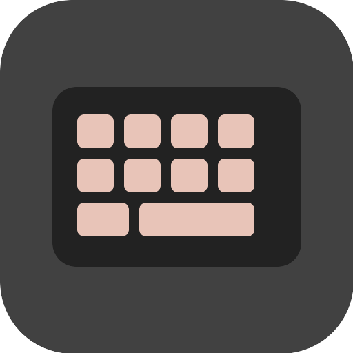

<div align="center">
  

  <h1>keyflare</h1>

  <p><strong>build fixed-color reactive lighting into QMK firmware without editing C by hand.</strong></p>

  <p>
    <a href="https://github.com/Microck/keyflare-qmk-tool/releases"></a>
    <a href="https://github.com/Microck/keyflare-qmk-tool/actions/workflows/ci.yml"></a>
    <a href="LICENSE"></a>
  </p>
</div>

choose your QMK keyboard source folder, keep its default keymap or import your own `keymap.json`, select the lighting channels QMK actually declares, and save a firmware file for your normal flashing tool.

keyflare never guesses where LEDs are installed. if QMK only declares a Scroll Lock indicator, Scroll Lock is the only channel you can select. the physical LED decides the color.

---

## features

- local QMK keyboard source import, including target families with revisions
- default QMK keymaps or imported `keymap.json` files for the same target
- read-only keyboard geometry from QMK layout metadata
- RGB Matrix reactive effect while keys are held, plus standard backlight, Num Lock, Caps Lock, Scroll Lock, Compose, and Kana channels
- `.hex`, `.bin`, and `.uf2` output through the real QMK compiler
- isolated Electron renderer with a small validated IPC surface
- no per-key LED guesses, or built-in flashing

---

## how it works

```text
keyboard source + keymap + selected declared channels
                         |
                         v
                  keyflare desktop app
                  - reads QMK metadata
                  - shows keyboard geometry
                  - adds keyflare/reactive
                         |
                         v
                  pinned qmk_firmware
                         |
                    qmk compile
                         |
                         v
                 .hex / .bin / .uf2
                         |
                         v
               your usual flashing tool
```

the generated QMK module counts held physical keys. it turns the selected channels on after the first press, then restores the existing backlight or host indicator state after the last release.

the preview highlights every key for backlight and the matching logical lock key for an indicator. this feedback explains the selected channel. it does not claim that the indicator LED is physically installed under that key.
the RGB Matrix channel runs QMK's typing heatmap effect while at least one key is held, then restores the user's saved effect and on/off state without EEPROM writes.

---

## usage

1. install QMK's supported build environment for your operating system.
2. open keyflare and let it download the pinned QMK source on first launch.
3. choose the QMK keyboard source folder you intend to build. if it contains several revisions, choose the exact target from the aligned variant menu.
4. use the default keymap or import a matching QMK `keymap.json`.
5. select one or more declared reactive channels.
6. build and save the firmware artifact.
7. flash it with QMK Toolbox, QMK CLI, or your usual bootloader-specific tool.

keyflare compiles firmware. it does not put a keyboard into bootloader mode, install drivers, or flash the device for you.

---

## supported channels

| QMK metadata                                    | keyflare behavior                            |
| ----------------------------------------------- | -------------------------------------------- |
| standard backlight feature with a declared pin  | offer the keyboard backlight                 |
| standard lock or host indicator pin             | offer that exact indicator                   |
| RGB matrix with a declared driver or WS2812 pin | offer a reactive RGB Matrix channel          |
| no supported declared channel                   | explain that the target cannot be configured |

this is deliberately strict. a keyboard photo, layout shape, compiled firmware file, or model name is not enough evidence to infer physical LED wiring.

---

## requirements

keyflare uses QMK's supported host environment instead of bundling several gigabytes of compilers and device tools.

- **Windows:** install QMK MSYS. keyflare detects `C:\QMK_MSYS` automatically,
  or lets you choose the `QMK_MSYS` folder when it is installed elsewhere.
- **macOS:** install QMK with Homebrew and complete `qmk setup`.
- **Linux:** install QMK CLI and run the QMK bootstrap setup for your distribution.

run `qmk doctor` if setup fails. keyflare accepts QMK's minor-warning status because missing flashing rules do not block compilation, but it stops on major toolchain errors.

the managed QMK core is pinned to `9caa5f871ddb9813c7370708be62d7a3e1cfeb75`. a keyboard folder is not a complete compiler, so keyflare keeps the build system in a sparse checkout that excludes QMK's upstream keyboard catalog. users import only the keyboard source they want to build.

---

## development

keyflare uses Bun, React, Electron, and electron-vite.

```bash
bun install
bun run dev
```

run the complete local verification suite:

```bash
bun run verify
bun run format:check
```

create an unpacked build for the current platform:

```bash
bun run package
```

the release workflow builds unsigned Windows x64, macOS x64/ARM64, and Linux x64 artifacts when a `v*` tag is pushed.

---

## architecture

- `src/renderer` owns the VIA-inspired interface and has no Node.js access.
- `src/preload` exposes fixed operations through Electron's context bridge.
- `src/main/index.ts` accepts dialogs only from the active trusted window.
- `src/main/app-service.ts` owns selected-source and selected-keymap paths, compilation requests, and artifact saving.
- `src/main/firmware-build.ts` validates QMK, imports one keyboard family into the managed checkout, and runs each compilation in an isolated temporary userspace.
- `src/shared` contains the validated IPC and QMK metadata contracts.
- `resources/qmk-module/keyflare/reactive` contains the QMK Community Module copied into each managed build.

the Electron window uses context isolation, renderer sandboxing, no Node.js integration, schema-validated IPC inputs, and denied child windows. imported source paths never become renderer-controlled build input.

---

## license

the desktop application is available under the [MIT License](LICENSE).

the generated QMK Community Module is available under [GPL-2.0-or-later](resources/qmk-module/keyflare/reactive/LICENSE), matching its QMK integration boundary.

the interface takes product inspiration from [VIA](https://github.com/the-via), but uses original code, layout, styling, and assets.
